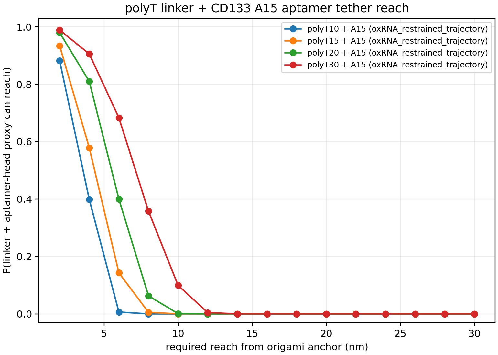
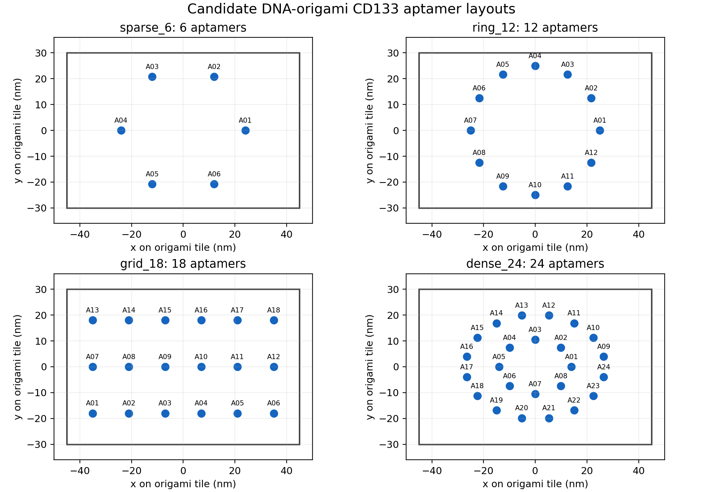
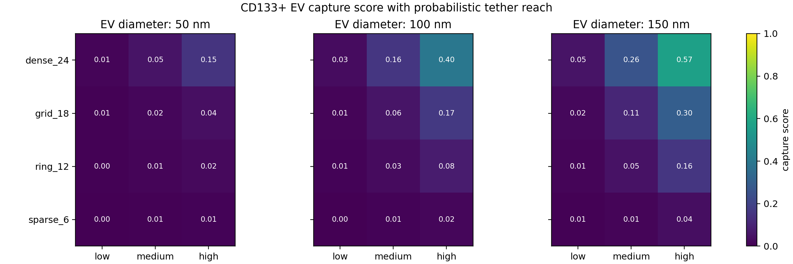
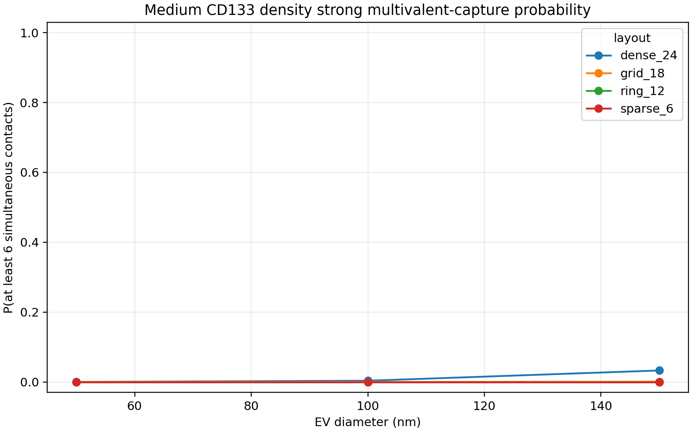
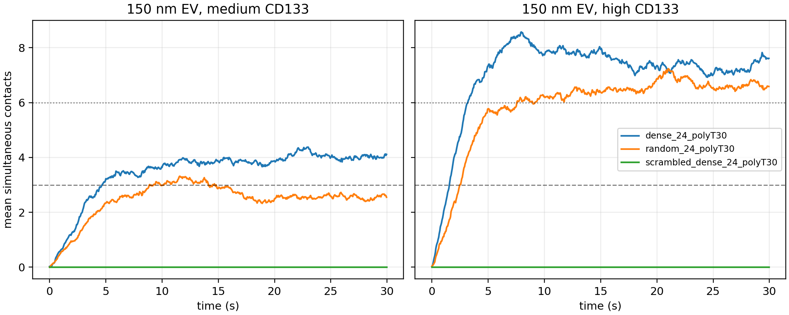

# Research Report: DNA-Origami-Scaffolded Aptamer Array for CD133+ EV Capture

**Date:** June 6, 2026  
**Project:** DNA-origami-scaffolded A15 aptamer display for CD133+ extracellular vesicle capture  
**Current lead design:** dense_24 aptamer layout with polyT30/A15 capture constructs

## Executive Summary

This project is developing a computational design workflow for capturing CD133-positive extracellular vesicles (EVs) using DNA-origami-scaffolded aptamer arrays. The system uses the Shigdar A15 CD133 aptamer, modeled with a poly-T linker, displayed on a 90 nm x 60 nm DNA origami tile. The central research question is whether nanoscale aptamer placement and linker reach can improve multivalent EV capture under finite receptor availability.

Before today, the project had established an oxDNA/oxRNA-guided molecular reach model, generated four candidate origami aptamer layouts, and scored those layouts with a static finite-receptor EV geometry model. That first-pass static model favored the dense_24 layout using polyT20 linkers.

Today, we advanced the computational workflow in two ways. First, we ran a stronger control and sensitivity analysis across polyT15, polyT20, and polyT30 linkers, including 50-replicate matched random controls and scrambled/nonbinding controls. This shifted the current lead from dense_24/polyT20 to dense_24/polyT30. Second, we implemented a lightweight Brownian dynamics simulator to test whether the static geometric advantage translates into dynamic multivalent capture over time. The dynamic model supports dense_24/polyT30 as the current first simulation candidate, especially under medium CD133 receptor density where receptor availability is limiting.

The work is still not ready for fabrication. The next phase should refine and stress-test the dynamic model before exporting to a more formal HOOMD-blue or LAMMPS simulation.

## Work Completed Before Today

### Aptamer and Linker Reach Calibration

The A15 aptamer was represented using the sequence `CCCUCCUACAUAGGG`, with T substituted for U where needed by DNA-oriented tooling. Restrained oxRNA trajectory analysis estimated the A15 binding-face reach from the conjugation point. The restrained A15 trajectory preserved all four predicted stem pairs in 63.4% of sampled frames using a 1.5 nm closure criterion. The A15 head reach was approximately 2.17 nm at the median and 2.72 nm at p90.

In parallel, polyT10, polyT15, polyT20, and polyT30 linker simulations were analyzed using oxDNA trajectories. The linker and aptamer-head reach distributions were combined by isotropic vector composition to estimate construct-level reach survival curves.

The polyT30/A15 construct showed the broadest reach distribution, with mean reach approximately 7.08 nm, median reach approximately 7.16 nm, and p90 reach approximately 9.99 nm. This made polyT30 a plausible candidate for improving EV receptor engagement, but before today it had not been propagated through the full control and dynamic workflow.

### Origami Layout Design

Four first-generation aptamer layouts were generated on a 90 nm x 60 nm DNA origami tile:

| Layout | Aptamer Count | Design Role |
|---|---:|---|
| sparse_6 | 6 | Low-density broad ring control |
| ring_12 | 12 | Circular intermediate-density layout |
| grid_18 | 18 | Rectangular distributed layout |
| dense_24 | 24 | High-density lead candidate |

### Static EV Capture Scoring

The static finite-receptor scorer modeled CD133 sites as stochastic receptor positions on the lower EV hemisphere. Each receptor could bind at most one aptamer in a given trial, making receptor occupancy finite rather than unlimited. The scorer swept 50, 100, and 150 nm EVs under low, medium, and high CD133 density assumptions.

Before today, the strongest static case was dense_24/polyT20 against a 150 nm high-CD133 EV, with mean contacts 4.334, P>=3 contacts 0.8121, P>=6 contacts 0.2681, and capture score 0.5676.

The earlier result already suggested that dense aptamer placement was favorable, but it did not fully answer whether dense_24 was winning because of geometry, aptamer count, linker length, or a favorable static scoring assumption.

## Work Completed Today

### Stronger Linker Sensitivity and Control Analysis

Today we added and ran:

`score_ev_capture_sensitivity_controls.py`

This script extended the static analysis without overwriting the original baseline. It asked three follow-up questions:

1. Does the lead design survive linker-length sensitivity?
2. Does dense_24 still beat matched random 24-anchor layouts with more control replicates?
3. What should a scrambled/nonbinding aptamer chemistry control score under the same reporting schema?

The analysis generated:

| Output | Purpose |
|---|---|
| `ev_capture_linker_sensitivity.csv` | Scores all layouts under polyT15, polyT20, and polyT30 |
| `ev_capture_dense24_random_controls_50rep.csv` | 50-replicate matched random controls for dense_24 |
| `ev_capture_scrambled_controls.csv` | Geometry-preserving scrambled/nonbinding controls |
| `ev_capture_next_stage_controls_summary.json` | Summary of lead cases and interpretation |

The strongest sensitivity case was:

| Layout | Linker | EV Diameter | CD133 Density | Mean Contacts | P>=6 Contacts | Capture Score |
|---|---|---:|---|---:|---:|---:|
| dense_24 | polyT30 | 150 nm | high | 7.850 | 0.7853 | 0.9152 |

The best medium-density dense_24 case was also polyT30:

| Layout | Linker | EV Diameter | CD133 Density | Mean Contacts | P>=6 Contacts | Capture Score |
|---|---|---:|---|---:|---:|---:|
| dense_24 | polyT30 | 150 nm | medium | 4.433 | 0.2880 | 0.5753 |

The top matched random control was random_24/polyT30 for 150 nm high-CD133 EVs. It scored 0.7224, while the matched dense_24/polyT30 design scored 0.9152. The score delta was +0.1928 in favor of dense_24. Across the tested polyT30 cases, dense_24 beat the 50-replicate random controls for every EV size and CD133 density condition.

This result shifted the current design lead from dense_24/polyT20 to dense_24/polyT30.

### Minimal Brownian Dynamics Simulation

Because the project is not yet ready for fabrication, we implemented the next computational layer: a lightweight dynamic EV capture simulator.

The new script is:

`simulate_ev_capture_dynamics.py`

The model treats the origami tile as fixed and the EV as a Brownian sphere near the tile. CD133 receptors are placed on the lower EV hemisphere. Aptamer/receptor bonds form probabilistically when receptor-anchor distances fall within the calibrated polyT30/A15 reach distribution, and bonds can unbind over time. This is not a fitted physical kinetic model; it is a relative design/control comparison that tests whether static reach advantage produces persistent multivalent contact.

The simulator compared:

| Case | Description |
|---|---|
| dense_24_polyT30 | Current lead geometry and linker |
| random_24_polyT30 | Aggregated matched random 24-anchor controls |
| scrambled_dense_24_polyT30 | Same dense_24 geometry, but receptor-specific binding activity set to zero |

The simulation focused on 150 nm EVs at medium and high CD133 density, using 80 trajectories per case.

Dynamic simulation summary:

| Case | CD133 Density | Capture Probability | Mean Contacts | Mean Last-Quarter Contacts | Strong Contact Fraction |
|---|---|---:|---:|---:|---:|
| dense_24_polyT30 | medium | 0.8000 | 3.474 | 4.049 | 0.2954 |
| random_24_polyT30 | medium | 0.6250 | 2.448 | 2.557 | 0.1908 |
| scrambled_dense_24_polyT30 | medium | 0.0000 | 0.000 | 0.000 | 0.0000 |
| dense_24_polyT30 | high | 0.8375 | 7.044 | 7.276 | 0.5891 |
| random_24_polyT30 | high | 0.8250 | 5.855 | 6.623 | 0.5578 |
| scrambled_dense_24_polyT30 | high | 0.0000 | 0.000 | 0.000 | 0.0000 |

The most important dynamic finding is that dense_24/polyT30 has a clear advantage over random_24/polyT30 at medium CD133 density. At high CD133 density, random_24 nearly catches up in capture probability, but dense_24 still shows higher mean contact count and stronger multivalent occupancy. This suggests dense_24 geometry matters most under receptor-limited conditions, which is biologically relevant because EV CD133 copy number may be heterogeneous and finite.

## Current Interpretation

The project has moved from an initial static geometry screen to a stronger computational design argument:

1. A15 aptamer and poly-T linker reach have been calibrated from oxDNA/oxRNA trajectories.
2. dense_24 is the strongest layout family under static finite-receptor scoring.
3. polyT30 improves the dense_24 design relative to polyT20 under the current assumptions.
4. dense_24/polyT30 beats matched random 24-anchor controls in static sensitivity analysis.
5. dense_24/polyT30 also shows improved dynamic capture behavior under medium receptor density.

The central conclusion for today is:

**dense_24/polyT30 should remain the first dynamic-simulation candidate, but fabrication should wait until the dynamic model is further validated and stress-tested.**

## Limitations

The current dynamic model is intentionally simple. It should not yet be interpreted as a physical prediction of experimental capture rates.

Key limitations:

- The Brownian dynamics model uses phenomenological binding and unbinding rates, not measured A15/CD133 kinetics.
- EV receptor mobility, membrane diffusion, and receptor clustering are not yet explicitly modeled.
- The EV is represented as a simple sphere with receptors on the lower hemisphere.
- The origami tile is fixed and does not yet include scaffold deformation or surface attachment effects.
- The scrambled control is represented by zero receptor-specific binding activity rather than an explicit nonspecific interaction model.
- Only 150 nm EVs at medium and high CD133 density were tested dynamically.

These limitations are acceptable for a first dynamic bridge model, but they should be addressed before any fabrication decision.

## Recommended Next Steps

### 1. Stress-Test the Dynamic Model

Run a parameter sensitivity analysis over:

- `k_on` multiplier
- `k_off`
- EV diffusion coefficient
- capture dwell threshold
- required contact threshold
- EV starting distance and lateral offset

The key question is whether dense_24/polyT30 remains better than random_24/polyT30 under a reasonable range of dynamic assumptions.

### 2. Expand Dynamic Conditions

Add dynamic simulations for:

- 50 nm EVs
- 100 nm EVs
- low CD133 density
- grid_18/polyT30 backup design
- dense_24/polyT20 for direct comparison with the earlier lead

This will show whether polyT30 is broadly better or mainly helps large EVs.

### 3. Add More Realistic Receptor Behavior

The next model should include at least one of:

- receptor lateral diffusion on the EV surface
- receptor clustering
- finite receptor accessibility near the membrane-contact patch
- partial nonspecific binding for scrambled controls

This would make the model more biologically realistic without yet requiring full molecular simulation.

### 4. Prepare an Engine-Export Specification

Once the lightweight dynamic model is stable, prepare export-ready geometry and parameter files for HOOMD-blue or LAMMPS:

- origami tile coordinates
- dense_24/polyT30 anchor positions
- EV sphere radius and initial placement
- receptor count and distribution
- tether interaction rule
- aptamer/receptor binding state model

### 5. Delay Fabrication Until the Dynamic Model Is Robust

Fabrication should wait until dense_24/polyT30 survives:

- dynamic parameter sensitivity
- multiple EV sizes
- receptor-density variation
- random layout controls
- scrambled/nonbinding controls
- backup-design comparison against grid_18/polyT30

If dense_24/polyT30 remains the lead after those tests, the project will be in a much better position to justify a first experimental design package.

## Files Generated or Used Today

| File | Role |
|---|---|
| `score_ev_capture_sensitivity_controls.py` | Static linker sensitivity and control analysis |
| `ev_capture_linker_sensitivity.csv` | Linker sensitivity results |
| `ev_capture_dense24_random_controls_50rep.csv` | Matched random control results |
| `ev_capture_scrambled_controls.csv` | Scrambled/nonbinding control results |
| `ev_capture_next_stage_controls_summary.json` | Static next-stage summary |
| `simulate_ev_capture_dynamics.py` | Minimal Brownian dynamic capture model |
| `ev_capture_dynamics_summary.csv` | Dynamic simulation summary |
| `ev_capture_dynamics_summary.json` | Dynamic simulation metadata and interpretation |
| `ev_capture_dynamics_trajectories.csv` | Per-trajectory dynamic contact traces |
| `ev_capture_dynamics_contacts.png` | Dynamic mean-contact figure |

